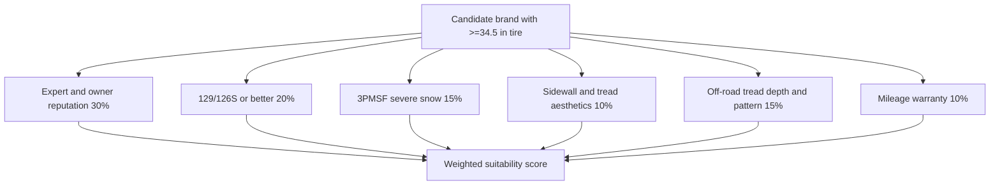
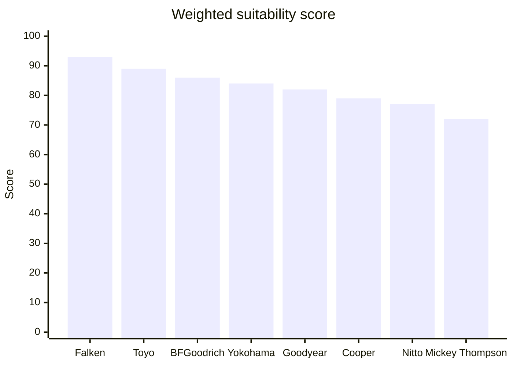
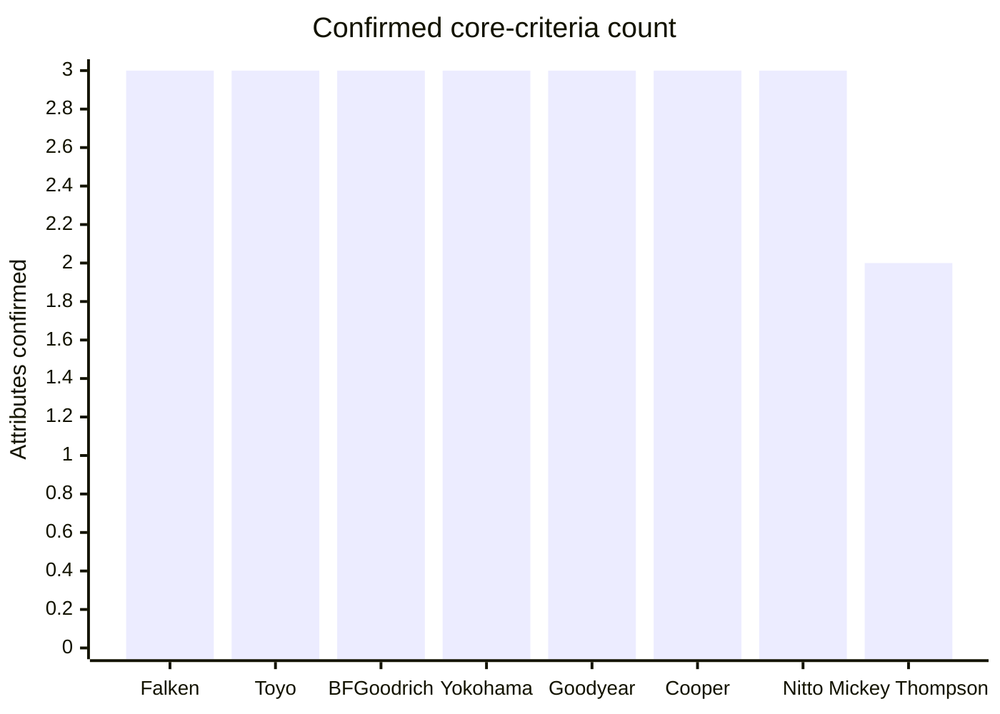

# Replacement Tire Brand Assessment for the 2026 GMC Sierra AT4 EV

## Deep Research - Executive summary

For the priorities you specified, the strongest overall brand fits are **Falken**, **Toyo**, and **BFGoodrich**. Falken’s WILDPEAK A/T4W stands out because it combines confirmed **129/126S** sizes above the 34.5-inch threshold, **3PMSF**, a **60,000-mile LT warranty**, very deep **18/32-inch** tread, and strong owner feedback at Tire Rack. Toyo’s Open Country A/T III is the most balanced “safe choice,” with extensive owner history, strong winter and tread-life positioning, confirmed **129/126S** large sizes, and a **50,000-mile LT warranty**. BFGoodrich’s All-Terrain T/A KO3 remains a benchmark for owner satisfaction, winter traction, and rugged looks, but it gives up some tread depth versus Falken and Yokohama. citeturn25search0turn25search8turn45search3turn42view0turn26search18turn44search0turn45search2turn29search1turn27search2

The next tier is **Yokohama**, **Goodyear**, and **Cooper**. Yokohama’s GEOLANDAR A/T4 is unusually compelling on paper because it offers **18/32-inch** tread, dual-sidewall styling, **129/126S** sizes at **34.8–35.4 inches**, **3PMSF**, and a **55,000- to 65,000-mile warranty**, but owner-review volume is still limited because it is newer. Goodyear’s Wrangler DuraTrac RT brings excellent tread depth, confirmed **129/126S** fitments, **3PMSF**, and a **50,000-mile warranty**, but early expert testing suggests it is not as balanced on wet/dry performance as the best all-terrain leaders. Cooper’s Discoverer Stronghold AT meets the core technical criteria well and offers a strong **60,000-mile warranty**, but independent testing suggests it trades some refinement and wet/dry balance for strong snow performance. citeturn31view1turn30search2turn30search5turn30search1turn34search2turn46search0turn46search5turn34search0turn34search3turn15search0turn13search10turn39search0turn39search4

The most specialized picks are **Nitto** and **Mickey Thompson**. Nitto’s Terra Grappler G3 is a strong all-weather all-terrain option with **3PMSF**, a confirmed **129/126S** 35.12-inch size, a **55,000-mile LT warranty**, and excellent wet-test performance in Tire Rack’s 2025 on-road all-terrain test, but its winter behavior was less favored there than leading snow-focused competitors. Mickey Thompson’s Baja Boss A/T is the most visually aggressive option in this group and has very deep tread, **3PMSF**, and a **50,000-mile LT warranty**, but in the large sizes reviewed it typically tops out at **Q** speed rating rather than **S**, so it misses your **129/126S-or-better** preference. citeturn19view2turn18view0turn20search6turn24search0turn37view3turn22search12turn38search3turn23search7

## Method and weighting

This assessment treated the Sierra AT4 EV strictly as an unspecified fitment target. No wheel diameter, wheel width, bolt pattern, or factory tire size was assumed. Screening was limited to brands offering at least one replacement all-terrain or rugged-terrain tire with **overall diameter at or above 34.5 inches**, then ranked against your priorities: expert/owner reputation, confirmation of **129/126S or better**, **3PMSF**, aggressive sidewall/tread styling, off-road-capable tread pattern depth, and mileage warranty. Where a detail could not be confirmed from the sources retrieved, it is marked **unspecified**. citeturn29search1turn25search8turn31view1turn34search2turn13search10turn19view2turn37view3

The suitability ranking below uses this weighting model: **ratings and reputation 30%**, **129/126S compliance 20%**, **3PMSF 15%**, **sidewall/tread aesthetics 10%**, **tread depth and off-road readiness 15%**, and **mileage warranty 10%**. The weighting is analytical rather than manufacturer-supplied; the underlying brand facts come from the cited sources in the comparison table. Where the scoring requires judgment, that judgment is explicitly based on the sourced evidence summarized in the table. 

## Comparison of the eight brands

| Brand | Example model with official spec link | Available sizes ≥34.5" reviewed | Confirmed 129/126S or better | 3PMSF | Typical tread depth | Sidewall styling notes | Mileage warranty | Expert and owner rating summary | Primary sources |
|---|---|---|---|---|---|---|---|---|---|
| **Falken** | WILDPEAK A/T4W official page citeturn45search3 | LT285/75R18 **35.0"**; 35x11.5R18LT also offered citeturn25search8turn25search14 | **Yes** — LT285/75R18 **129/126S** citeturn25search0turn25search8 | **Yes** citeturn25search0 | **18/32" = 14.3 mm** in LT285/75R18 citeturn25search8 | Raised black lettering; staggered shoulder / sidewall elements are emphasized in Falken’s own material and retailer buyer’s guides. citeturn45search15turn25search0 | **Yes** — **60,000 miles for LT**, 65,000 for non-LT citeturn45search3turn45search8 | Tire Rack shows **4.5/5 stars** with **540 survey ratings / 414 reviews** for the LT285/75R18 page, making this one of the most proven combinations of reputation and spec fit. citeturn25search0 | Official: Falken product/warranty citeturn45search3turn45search11; Specs/ratings: Tire Rack citeturn25search0turn25search8 |
| **Toyo** | Open Country A/T III official page citeturn42view0 | LT285/75R18 nominally **≈34.8"**; LT315/75R16 **34.6"** in Tire Rack specs; additional ≥34.5" sizes listed by retailers. Exact full ≥34.5" Toyo size list was not completely retrieved from the official page. citeturn44search1turn44search0 | **Yes** — LT285/75R18 **129/126S** is listed by Tire Rack. citeturn13search1turn44search1 | **Yes** citeturn42view0turn41search4 | **Unspecified for the exact ≥34.5" size retrieved;** LT-family samples in Tire Rack specs run roughly **16.0–16.9/32" = 12.7–13.4 mm**. citeturn44search0 | Toyo notes **three distinct tread/shoulder designs** by construction/size, with some sizes also available in **outline white lettering**. citeturn42view0 | **Yes** — **50,000 miles for LT/flotation**, 65,000 for P/Euro-metric citeturn42view0 | Toyo’s own site shows **3.8/5 from 302 reviews** and strong internal performance ratings for tread life and winter handling; Tire Rack shows **4.5/5 stars** from **802 reviews / 586 survey ratings**. citeturn41search11turn42view0turn26search18 | Official: Toyo product/performance/warranty citeturn42view0turn41search4; Ratings/specs: Tire Rack citeturn26search18turn44search0turn44search1 |
| **BFGoodrich** | All-Terrain T/A KO3 official page citeturn45search2 | LT285/75R18 **34.8"**; LT295/65R20 **35.1"**; LT325/60R20 **35.4"** citeturn29search1 | **Yes** — LT285/75R18 **129/126S**; LT295/65R20 **129/126S** citeturn27search0turn29search1 | **Yes** citeturn28search2turn29search0 | **16/32" = 12.7 mm** in LT285/75R18 and LT295/65R20 citeturn29search1 | KO3 keeps the classic KO-series off-road look, includes raised-white-letter availability in some sizes, and owner-review material specifically mentions aggressive styling. citeturn29search0turn45search18 | **Yes** — **50,000 miles** citeturn45search2turn45search14 | Very strong reputation signal: BFGoodrich’s site shows **3.8/5 from 260 reviews**, while Tire Rack shows **4.5/5 stars** with **523 reviews / 374 survey ratings** and **100% recommended** in the detailed survey summary. citeturn45search9turn27search2turn27search3 | Official: BFGoodrich product/reviews citeturn45search2turn45search18; Specs/ratings: Tire Rack citeturn27search0turn27search2turn29search1 |
| **Yokohama** | GEOLANDAR A/T4 official page citeturn30search2 | LT285/75R18 **34.8"**; LT295/65R20 **35.4"**; LT325/60R20 **35.5"** citeturn31view1 | **Yes** — LT285/75R18 **129/126S** and LT295/65R20 **129/126S** citeturn31view1 | **Yes** citeturn30search5turn30search2 | **18/32" = 14.3 mm** in the reviewed LT sizes above 34.5" citeturn31view1 | Dual-sidewall design lets buyers choose appearance; official launch material highlights that styling flexibility explicitly. citeturn30search5turn30search2 | **Yes** — **55,000 to 65,000 miles** depending on size/application citeturn30search5 | Strong specification match, but owner data is still thinner: Tire Rack shows **14 survey ratings** and **not yet rated**, so this is a high-paper-score option with less mature replacement-market feedback. citeturn30search1 | Official: Yokohama product/news citeturn30search2turn30search5; Specs/ratings: Tire Rack citeturn31view1turn30search1 |
| **Goodyear** | Wrangler DuraTrac RT-LT official page citeturn32search1 | LT285/75R18 **35.1"**; LT285/65R20 **34.8"**; 35x12.5R18LT **34.7"** citeturn34search2 | **Yes** — LT285/75R18 **129/126S** citeturn32search0turn34search2 | **Yes** citeturn46search0turn46search2turn46search5 | **18/32" = 14.3 mm** in LT285/75R18 citeturn32search9 | Extended over-the-shoulder tread and Kevlar / 3-ply sidewall emphasis give it a rugged functional look rather than a highly decorative one. citeturn46search5 | **Yes** — **50,000 miles** citeturn33view0turn46search5 | Tire Rack shows **4.5/5 stars** with **159 reviews / 109 survey ratings**; Discount Tire shows **4.6–4.7** depending on size pages. Tire Rack’s 2025 test described it as solid but not class-leading in wet/dry responsiveness. citeturn34search0turn46search5turn34search3 | Official: Goodyear product/size pages citeturn32search1turn32search4turn33view0; Specs/ratings: Tire Rack and Discount Tire citeturn32search9turn34search0turn46search5 |
| **Cooper** | Discoverer Stronghold AT official page citeturn15search0 | LT285/75R18 **34.8"** citeturn13search10 | **Yes** — LT285/75R18 **129/126S** citeturn13search1turn13search10 | **Yes** citeturn15search0turn13search1 | **17/32" = 13.5 mm** in LT285/75R18 citeturn13search10 | Cooper emphasizes scooped tread edges plus a **sidewall hook pattern** for added grip; styling is purposeful and moderately aggressive. citeturn39search1turn15search0 | **Yes** — **60,000 miles** citeturn15search0turn39search1 | Tire Rack’s summary describes the Stronghold AT as strong in dry traction and snow, but the 2024 off-road/on-road comparison found it louder and less balanced than the top all-rounders. citeturn39search0turn39search4 | Official: Cooper product page citeturn15search0; Specs/test: Tire Rack citeturn13search10turn39search0turn39search4; Retailer warranty summary citeturn39search1 |
| **Nitto** | Terra Grappler G3 official page citeturn18view0 | LT285/75R18 **34.84"**; LT295/65R20 **35.12"**; 37x12.5R20LT also offered citeturn19view0turn19view2turn19view3 | **Yes** — LT295/65R20 **129/126S**; LT295/70R18 **129/126S**; LT285/75R18 is **129/126R** only citeturn19view0turn19view2 | **Yes** citeturn18view0 | **16.1/32" = 12.8 mm** in LT295/65R20; **16.0/32" = 12.7 mm** in LT285/75R18 citeturn19view0turn19view2 | Nitto offers **dual sidewall designs** and explicitly emphasizes deep sidewall lugs and a distinct look. citeturn18view0 | **Yes** — **55,000 miles for LT/flotation**, 70,000 for hard-metric citeturn18view0 | Owner data at Tire Rack is still limited enough for “not yet rated,” but it already has **124 reviews** there, and Tire Rack’s 2025 test praised it as the wet-track leader while noting weaker winter results than the best snow-focused rivals. citeturn40search0turn20search6 | Official: Nitto product/performance/warranty/specs citeturn18view0turn19view0turn19view2; Reviews/tests: Tire Rack citeturn40search0turn20search6 |
| **Mickey Thompson** | Baja Boss A/T official page citeturn24search0 | LT295/70R18 **34.5"**; 35x11.5R20LT **34.6"**; 35x12.5R20LT **34.7"**; 37x12.5R20LT **36.7"** citeturn37view3 | **No** — large-size examples are typically **Q-rated**, e.g., LT295/70R18 **129Q** and 35x12.5R20LT **125Q**. citeturn37view3 | **Yes** — all sizes **12.50/315 and narrower** are severe-snow rated citeturn24search0 | **18.5/32" = 14.7 mm** in the large LT sizes shown on the official page citeturn37view3 | The most aggressive styling in this group: **Extreme Sidebiters** and Baja-inspired blocky shoulders are explicit product features. citeturn24search0 | **Yes** — **50,000 miles on LT sizes** citeturn22search12turn24search0 | Discount Tire shows **4.7/5** with **239 reviews** brandwide on the Baja Boss A/T listing, and enthusiast review coverage is very positive on on- and off-road versatility. The main technical miss for your criteria is speed rating. citeturn38search3turn23search7 | Official: Mickey Thompson product/warranty/specs citeturn24search0turn22search12turn37view3; Owner/expert feedback: Discount Tire and Trail4Runner citeturn38search3turn23search7 |

## Ranking and recommendations

### Overall suitability ranking

| Rank | Brand | Suitability view | Why it landed here |
|---|---|---:|---|
| **Falken** | **WILDPEAK A/T4W** | **Highest** | Best blend of technical compliance and desirability: confirmed **129/126S**, **3PMSF**, **60k LT warranty**, **18/32"** tread, and strong Tire Rack reputation. citeturn25search0turn25search8turn45search3 |
| **Toyo** | **Open Country A/T III** | **Very high** | Broadest owner-history confidence; strong winter and tread-life positioning; confirmed **129/126S** and LT mileage warranty, with slightly less aggressive/deep pattern emphasis than Falken. citeturn42view0turn26search18turn44search1 |
| **BFGoodrich** | **All-Terrain T/A KO3** | **Very high** | Iconic off-road aesthetic, top-tier owner recommendation rates, confirmed **129/126S**, **3PMSF**, and 50k warranty; loses a little ground on tread depth versus Falken/Yokohama/Goodyear. citeturn27search3turn29search1turn45search2 |
| **Yokohama** | **GEOLANDAR A/T4** | **High** | Excellent on-paper match with **35.4" 129/126S**, **18/32"**, 3PMSF, dual sidewalls, and warranty; held slightly lower only because replacement-market review depth is still thin. citeturn31view1turn30search5turn30search1 |
| **Goodyear** | **Wrangler DuraTrac RT** | **High** | Strong spec match and snow-capable rugged-terrain posture; slightly lower because early independent testing suggests less all-around polish than the leaders. citeturn34search2turn46search5turn34search3 |
| **Cooper** | **Discoverer Stronghold AT** | **Moderately high** | Meets the hard requirements well, especially winter and warranty, but testing indicates more compromise in noise and wet/dry balance. citeturn13search10turn15search0turn39search4 |
| **Nitto** | **Terra Grappler G3** | **Moderately high** | Strong aesthetics, good large-size coverage, 3PMSF and warranty confirmed, but winter-test weakness relative to the best snow-focused tires reduces fit to your priority stack. citeturn19view2turn18view0turn20search6 |
| **Mickey Thompson** | **Baja Boss A/T** | **Conditional** | Excellent if looks and off-road style dominate, but it does **not** satisfy your preferred **129/126S-or-better** threshold in the large sizes reviewed. citeturn37view3turn24search0turn22search12 |

### Short recommendation for the top three

**Falken** is the best all-around pick if you want the most complete technical match with minimal compromise. It is the strongest combination of load/speed compliance, winter certification, tread depth, and warranty, while still carrying the aggressive shoulder and sidewall look expected in a premium truck tire. citeturn25search0turn25search8turn45search3turn45search15

**Toyo** is the best choice if you value long-term owner confidence and a slightly more balanced road/off-road personality. It has the deepest review history among the top contenders in this set and retains strong winter and tread-life emphasis. citeturn26search18turn42view0turn41search11

**BFGoodrich** is the best choice if you want classic all-terrain aesthetics and a well-established enthusiast reputation without giving up 129/126S compliance and 3PMSF. It is the most “known quantity” here after Toyo, and the KO3 keeps the signature KO look that many owners specifically want on a full-size truck. citeturn27search2turn27search3turn45search18turn45search2

## Decision visuals

The chart below is an analytical synthesis of the sourced facts in the table, using the weighting model described earlier. It is not a manufacturer rating. Brands score higher when they combine confirmed **129/126S**, **3PMSF**, warranty, deeper tread, strong owner/expert evidence, and more distinctive sidewall/tread presentation.

A narrower compliance-only view is below. This compares just the three most concrete “must-have” attributes from your prompt: confirmed **129/126S-or-better**, confirmed **3PMSF**, and confirmed **mileage warranty**. Seven of the eight brands satisfy all three with the example models reviewed; Mickey Thompson misses only the speed-rating threshold. citeturn25search0turn45search3turn44search1turn42view0turn29search1turn45search2turn31view1turn30search5turn34search2turn46search0turn46search5turn13search10turn15search0turn19view2turn18view0turn37view3turn22search12

## Key caveats and fitment considerations

This report intentionally does **not** assume factory wheel diameter, width, or offset for the 2026 GMC Sierra AT4 EV. A brand can rank highly here and still be a poor final choice if your actual wheel width, suspension clearance, steering-lock clearance, or EV load requirements eliminate the specific size that made the brand attractive in this analysis. The comparison is therefore a **brand capability screen**, not a final fitment recommendation. 

A second caveat is that several brands now split their replacement truck lines into more than one sub-family. For example, Nitto’s **Terra Grappler G3** is materially better aligned to your winter-and-warranty priorities than the more styling-forward **Recon Grappler A/T**; similarly, Mickey Thompson’s Baja Boss A/T is more aligned to your off-road aesthetic priority than to your **129/126S-or-better** priority. This is why the table names the exact example model used to represent each brand. citeturn18view0turn17view0turn24search0turn37view3

Finally, a few data points remain less mature than others. Yokohama’s GEOLANDAR A/T4, for example, looks excellent on specifications and warranty, but Tire Rack still shows limited survey volume. When owner-feedback depth is part of the buying decision, Toyo, BFGoodrich, Falken, and Goodyear currently offer more confidence from replacement-market review count alone. citeturn30search1turn26search18turn27search2turn25search0turn34search0
